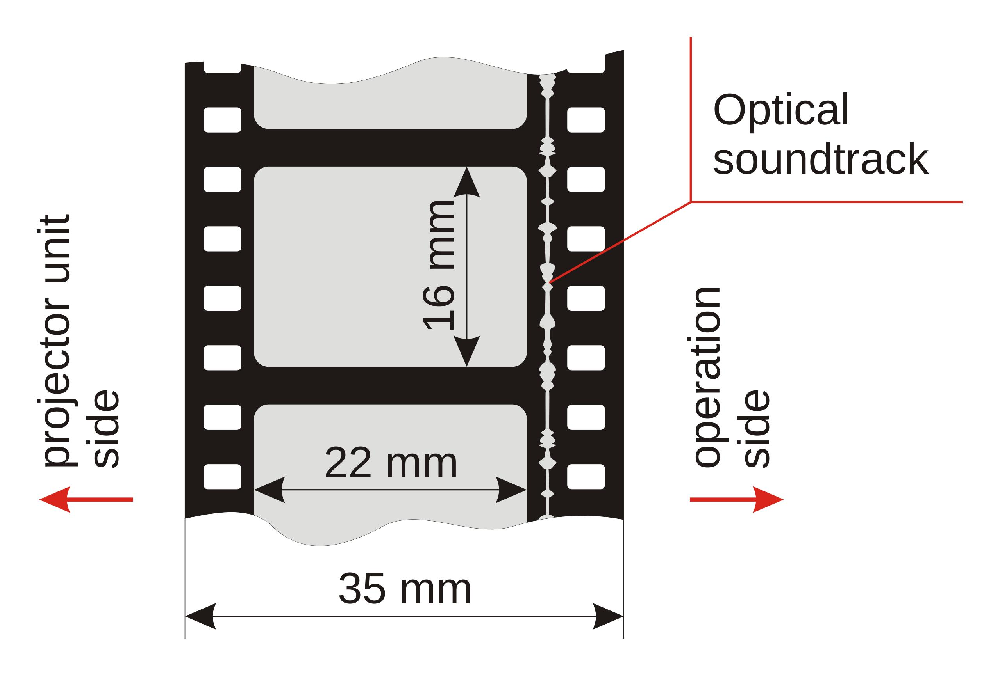
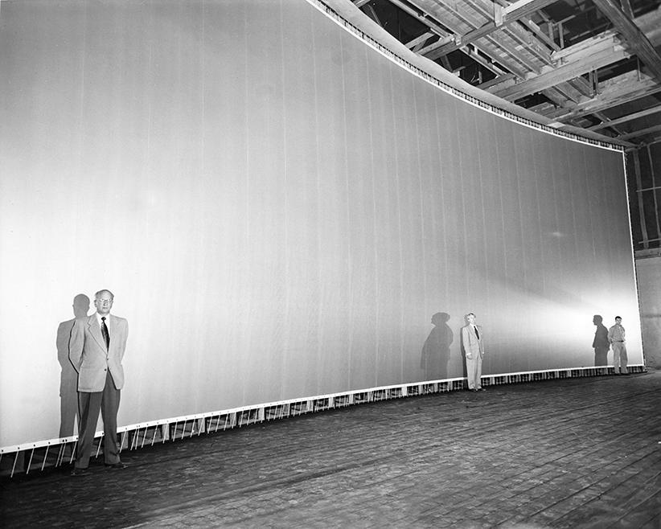
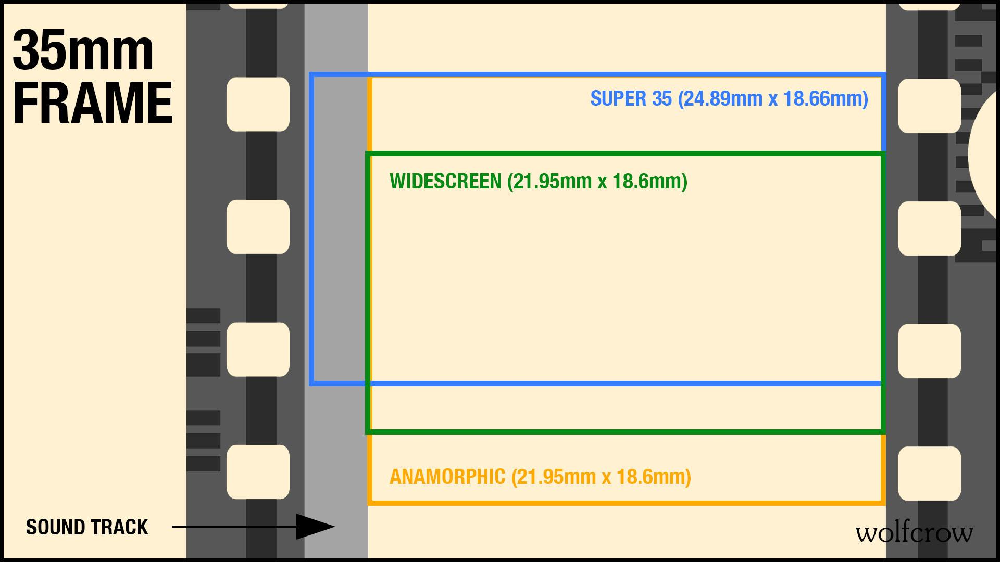
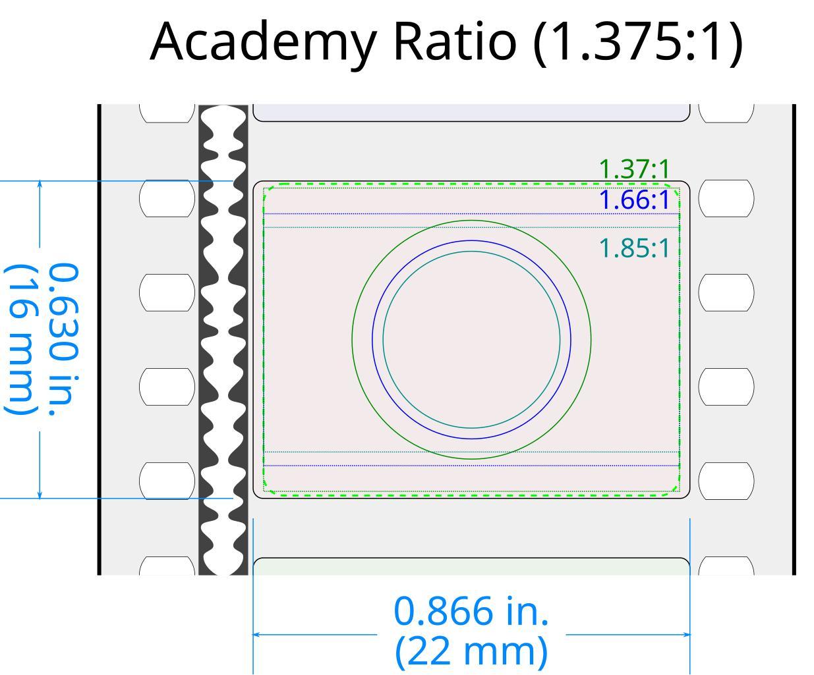
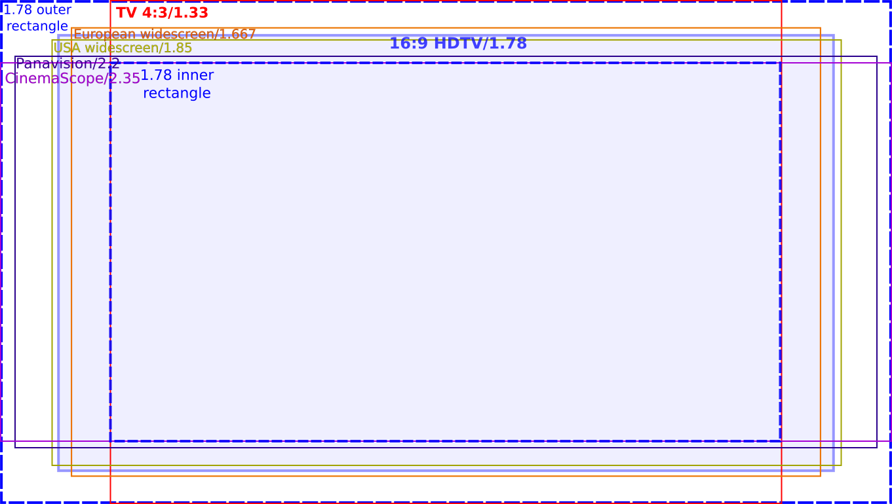
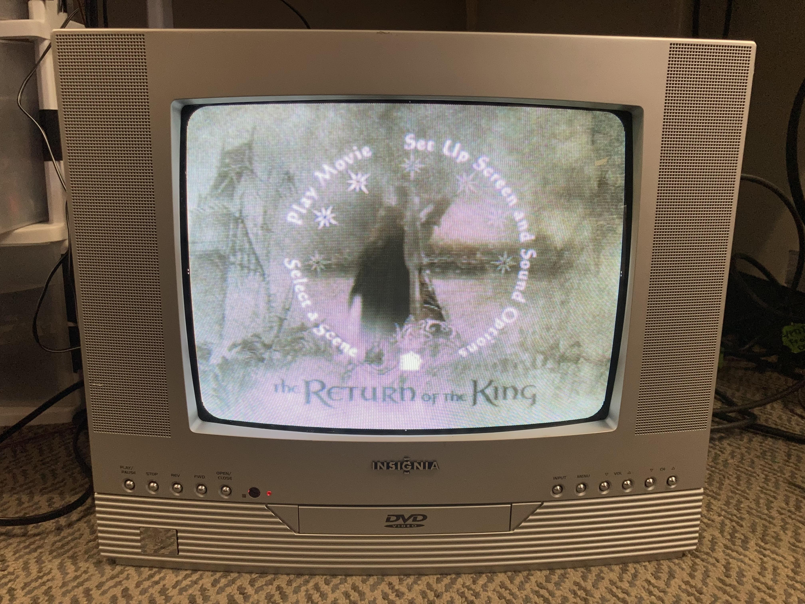
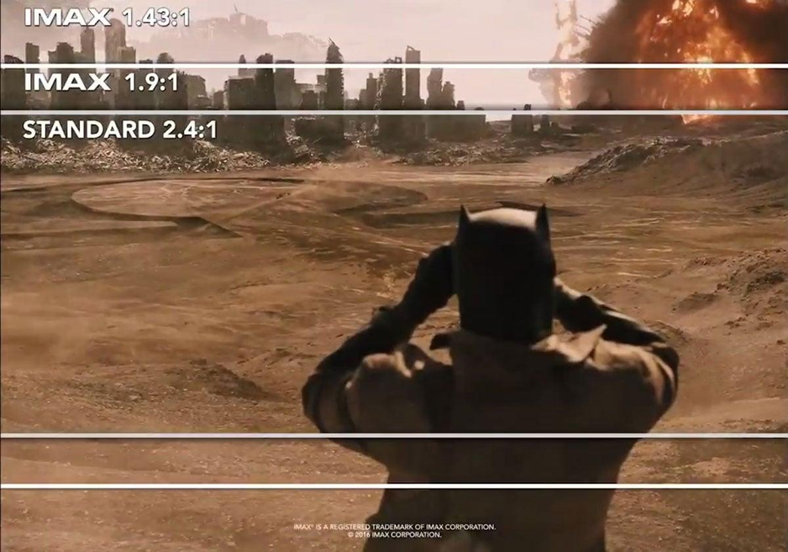
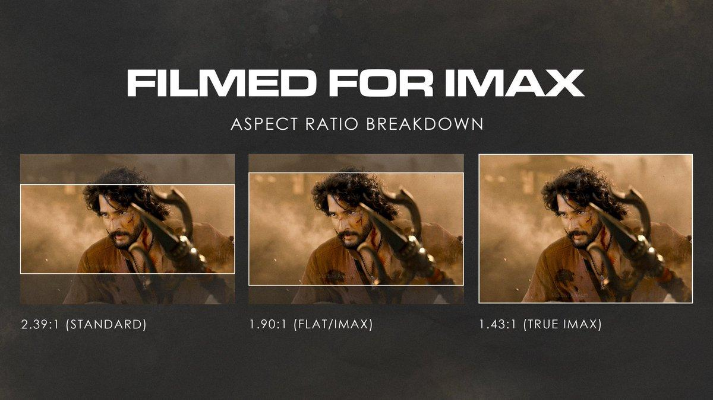

## 引子

最近在看 UHD 蓝光，盒背上印着一堆标签：2160p、2.39:1、HEVC、HDR10、Dolby Vision、Atmos。感觉还挺复杂的，正好诺兰的大片《奥德赛》又要上映，仔细一了解发现为什么 IMAX 有这么多比例？

为什么电影比例这么多，有1.43，1.90，2.35等等等等。还有各种厅的1.85等之类的。于是打算仔细研究一下，本着“哲学就是哲学史”这一想法，我觉得历史可能是更加合适的了解途径，而不是看各种技术博客或者走马观花式的一下子把所有内容都看了。

从历史的角度来看，每一个"理所当然"的参数，背后都是某个时代特定的技术约束和产业博弈，惯性的力量是强大的。

## 35mm 胶片：一切从一条窄带开始

1890 年代，爱迪生和 Dickson 建立了 35mm 电影系统。35mm 是整条胶片的宽度（Eastman Kodak 提供的胶卷规格），两边要留齿孔，真正能曝光的画面大约 24.9mm 宽；高度取决于每帧占几个齿孔。齿孔本身是机械抓取机构用来稳定传送胶片的，太少了抓不稳（画面会抖），太多了浪费胶片面积。4 个齿孔的高度刚好让画面比例接近 4:3（24.9/18.7 ≈ 1.33），同时机械传送也够稳定。

这才有了最终确认的 24.9mm × 18.7mm，算下来刚好约 1.33:1——就是 4:3。

4:3 不是经过视觉科学验证的"最佳比例"。它只是十九世纪末某套机械系统的副产品：胶片多宽、齿孔多大、一格占几个齿孔，这些选择组合起来碰巧得到一个接近方形的画面。后来整个产业都围绕这套系统制造摄影机、冲印机和放映机，它就从工程选择变成了工业标准。

然后声音来了。1920 年代末有声电影出现后，光学声轨需要印在胶片边缘，画面横向空间被硬生生切掉一条。

如果不处理，原来 1.33:1 的画面会变成一个偏高的方框。行业的解决办法是上下也裁掉一点，让投影出来的矩形重新接近大家习惯的形状。1932 年，这套标准形成 Academy Ratio——1.375:1，通常写作 1.37:1。

> 24fps 也是这时候定下来的。默片时代拍摄和放映速度都有浮动，但声音一旦直接跟着胶片走，放映速度就不能随意变化——快 5%，声音不仅快 5%，音调也会升高。24fps 是有声电影时代的工程和经济折中，后来经过近百年的使用才变成了"电影感"的文化认知。

## 电视继承 4:3，然后电影院慌了

电视在 1930-40 年代建立标准时，电影已经用了几十年的约 4:3 画面，整个社会积累了大量这种比例的内容。电视采用接近 4:3 的屏幕比例非常自然——旧电影拿到电视上播基本不需要裁切。

到了 1940 年代末，出现了一个特殊状态：电影院是 4:3 左右，家里的电视也是 4:3 左右。电影院原本最大的卖点——"你必须离开家才能看到活动影像"——开始被电视破坏了。

## 宽银幕战争：电影院故意变得不像电视

1952-1953 年前后，好莱坞没有选择"把 35mm 拍得更清楚一点"，而是开始激进地告诉消费者：电视能给你的只是一个小小的方框，真正的电影应该巨大、宽阔、彩色、立体。

最先造成震动的是 Cinerama。1952 年的《This Is Cinerama》用三台摄影机同时拍、三台放映机同时投影，把三幅 35mm 图像拼到一块巨大弧形银幕上。效果惊人，但三台放映机太麻烦，没法普及。

但它的商业成功释放了一个信号：观众愿意为了"大、宽、沉浸"重新走进电影院。于是 1953 年出现了 CinemaScope——在普通 35mm 镜头前加一个变形镜头（anamorphic lens），把宽场景水平方向"压瘦"约两倍塞进胶片，放映时再横向拉开。这样在同一条 35mm 胶片上就能得到约 2.35:1 的宽银幕。

> 后来 1970 年前后 SMPTE 稍微多裁掉一点上下，从 2.35 调成 2.39，原因之一是降低胶片拼接痕迹出现在银幕上的风险。今天 2.35、2.39、2.40 三种说法混着用，严格说现代标准是 2.39:1。

与此同时另一批公司走了更简单的路：不换镜头，直接把普通 35mm 画面的上下裁掉。原本 1.37:1 的画面，放映时遮掉上下就变成 1.85:1。1.85 很大程度上不是"获得了更多左右"，而是"放弃了上下"。但它够宽、够便宜、够兼容——摄影机不用重来，电影院现有放映机基本能继续用。

到 1950 年代末，1.37 已经基本退出美国主流影院。1.85（flat）和 2.39（scope）成为两个主要生态位，一直活到今天。它们不是某个组织算出来的"两个最佳比例"，而是那场格式大战最后活下来的两个位置。

值得一提的还有另一个 S35格式。传统 anamorphic 摄影有个限制：摄影时就决定了最终画幅。Super 35 换了个思路——摄影机负片又不需要播放声音，为什么要在拍摄阶段给声轨留位置？于是它把声轨区域也利用起来，回到接近默片的大画格，用普通球面镜头拍一个比较大的画面，后期再从里面裁出最终画幅。

这带来一个巨大的好处：你可以使用普通 spherical 镜头，更小、更轻、选择更多。《泰坦尼克号》虽然最终是 2.39:1，但主体是 Super 35 + 球面镜头拍摄，大约有 100 个镜头在后期做过垂直方向的重新构图。

Super 35 还有一个后来极其重要的副作用：原始负片记录了大量上下区域，做电视版时可以直接打开上下，得到接近 4:3 的画面。所以 VHS 和电视播映时代，一些电影的 4:3 版上下反而比宽银幕影院版看得更多。当然"看得更多"不等于"更正确"——导演可能从头到尾都是按 2.39 构图的。

> APS-C 的名字来自 Advanced Photo System（APS），1996 年由柯达、富士、佳能、尼康、美能达五家联合推出的胶片系统。APS 胶片本身有三种画幅（H/C/P），其中 C 幅和 S35 的关系是巧合性接近，并没有实际的继承关系。
> M4/3 则是数字时代的全新设计：2008 年奥林巴斯和松下联合推出，传感器 17.3×13mm，4:3 画幅。它不是从某个胶片格式裁切来的，而是数字时代第一次从零设计的可换镜头系统。
> 现代摄影系统更多还是从胶片机中横走胶片的格式继承过来，而不是从电影格式继承。当然，随着 CMOS 速度不断加快，这可能也会产生一些反过来的影响。

## 16:9：一个世纪的平均值

电影为了摆脱电视，从 1.37 走到了 1.85 和 2.39。但电视自己几十年一直停在 4:3。于是从 1950 年代到 1990 年代，电视行业一直在做一件尴尬的事：想办法把"故意做得不像电视"的电影重新塞回电视里。

- Pan & Scan 从宽画面里截取一个 4:3 窗口，左右移动跟随主体——构图被破坏，但电视分辨率用满。
- Letterbox 保留完整构图，但在标清时代上下黑边浪费了本来就稀缺的垂直分辨率。
- Open Matte 利用 Super 35 负片的额外上下区域，既不砍左右也不加黑边——但"多看到"不等于"导演想让你看"。

到了 1980 年代，HDTV 有机会重新制定标准。问题是：做多宽？怎么才能不浪费每一寸显示面积？

1984 年，SMPTE 工作组的 Kerns Powers 做了一个实验：把 4:3、1.66、1.85、2.35 等比例画成面积相同的矩形，中心重合叠在一起。结果发现这些比例的共同内部区域能包住它们的外部矩形，都落在约 1.77:1 附近。取成整数比例就是 16:9。

从数学上看，两个最极端的比例 4:3（1.33）和 Scope（2.35）的几何平均正好约等于 1.77。16:9 几乎坐在 4:3 和 Scope 的正中间。

而且一旦 16:9 成为 HDTV、DVD、Blu-ray、电脑显示器的大规模标准，它自己又开始反过来影响内容生产——电视节目直接按 16:9 拍，YouTube 默认 16:9。最开始只是兼容既有内容的妥协比例，用的人太多，就变成了新的内容生产标准。和 24fps、4:3、anamorphic 镜头缺陷变成审美，是同一种历史机制。

> 画幅讲的是画面形状，分辨率讲的是像素多少。两者经常被混。
> HD 是 1280×720，FHD 是 1920×1080，QHD 是 2560×1440，消费市场管它叫 2K。但 2K 在影院那边是另一个东西：DCI 2K 是 2048×1080，17:9 比例。所以 2K 其实有三个含义：影院的 2048×1080、显示器的 2560×1440、带鱼屏的 2560×1080。看到 2K 先分清是哪种。
> 4K 也分两种。消费级 UHD 是 3840×2160，市面上说的 4K、2160p 都是它。影院 DCI 4K 是 4096×2160。

## DVD 到 Blu-ray 到 UHD：数字家庭影音的三次跳跃

1996 年 DVD 商品化。它的革命性不是"清晰"——720×480 放在今天看很糊——而是电影第一次大规模变成了数字数据包。

> 随机跳章节、菜单、多语言、多音轨、复制不退化。DVD 的历史意义更接近"家庭电影数字化"而不是"家庭电影高清化"。

DVD 还有一个和 anamorphic 漂亮的联系：720×480 的像素不是正方形的，同一组数据可以按 4:3 或 16:9 显示。所谓"Anamorphic Widescreen DVD"的数学思想和 1950 年代 CinemaScope 一样——横向压缩存储，显示时展开。同一个词，完全不同的技术层级。

然后电视越来越大，从 25 英寸 CRT 变成 50 英寸 LCD，720×480 的 DVD 突然不够看了。2006 年 Blu-ray 补上了 1080p 高清 + 无损多声道音频（TrueHD、DTS-HD MA），还第一次很好地尊重了电影自己的 24fps——不再需要像 NTSC 时代那样做 3:2 pulldown。

但普通 Blu-ray 在其他方面仍然很"传统"：SDR、8-bit、Rec.709、4:2:0。真正把家庭影音带进 10-bit、HDR、广色域的是 2015 年的 UHD Blu-ray。这次升级不只是增加像素（1080→2160），而是同时换了色深（8→10-bit）、动态范围（SDR→HDR）、编码（AVC→HEVC）、色域（Rec.709→BT.2020 容器）。BDA 自己强调的是：不只是 more pixels，而是 better pixels。

编码代际也跟着跳：DVD 用 MPEG-2，Blu-ray 用 H.264/AVC，UHD Blu-ray 用 HEVC/H.265。每一代都是用更多计算复杂度换更高的压缩效率。所以不能脱离编码器谈码率——50 Mbps MPEG-2 和 50 Mbps HEVC 根本不是同一个概念。

码率的量级：蓝光 1080p 上限约 40 Mbps，UHD 蓝光上限约 100 Mbps，流媒体 4K 一般 15-25 Mbps。码率不够的表现是暗部发糊、快速运动出块状伪影。

## IMAX：不是屏幕大一点那么简单

IMAX 的故事和宽银幕战争几乎是反着来的。CinemaScope 是"横向拉得特别宽"，IMAX 的思想更接近"把人的整个视野填满"——不仅宽，而且特别高。

原始 IMAX 来自 15/70 胶片系统：70mm 胶片横着走，一帧占 15 个齿孔，画幅约 1.43:1。胶片的信息量换算过来等效约 18K，至今没有数字格式超过它。但摄影机巨大、胶片昂贵、放映机巨大、银幕必须专门设计，很难塞进普通商业影院。

2000 年代 IMAX 想大规模扩张，发展了 Digital IMAX：在普通商业影院改造一个影厅，数字投影 + IMAX 母版 + 更大银幕。这类数字 IMAX 大量采用 1.90:1——和 16:9 的 1.78 已经非常接近。

于是出现了"两层 IMAX"。1.43 是原始大型 IMAX 血统，需要 15/70 胶片放映或 GT Laser 双激光系统才能完整输出。1.90 是 IMAX 为了大规模进入商业影院形成的第二种生态，普通单激光（CoLa、XT）和早期氙灯数字 IMAX 都止步于此。

以《黑暗骑士》为例：普通影院 2.39，数字 IMAX 1.90，15/70 胶片或 GT Laser 1.43，Blu-ray/UHD 家庭版 1.78（填满 16:9 屏幕）。同一块 IMAX 负片，套了不同的"窗"。

## 一张 UHD 碟背 = 一百年技术史

现在回头看盒背上那堆标签：

2160p ← HDTV 从 1080p 继续向上
2.39:1 ← 1950 年代反电视的 CinemaScope 遗产
1.78:1 ← IMAX 家庭契合 16:9 的裁切方式
HEVC ← 四倍像素需要更高效的压缩
10-bit / HDR10 ← 不只追求 more pixels，开始追求 better pixels
Dolby Vision ← HDR 加入动态控制
TrueHD ← Blu-ray 时代的大容量无损编码
Atmos ← 2010 年代从固定声道转向三维声音对象

每一个词来自影视工业历史上不同年代解决的不同问题，最终被塞进一张 BD100 光盘里。

放入 PS5，开始观看，这历史似轻又重。
